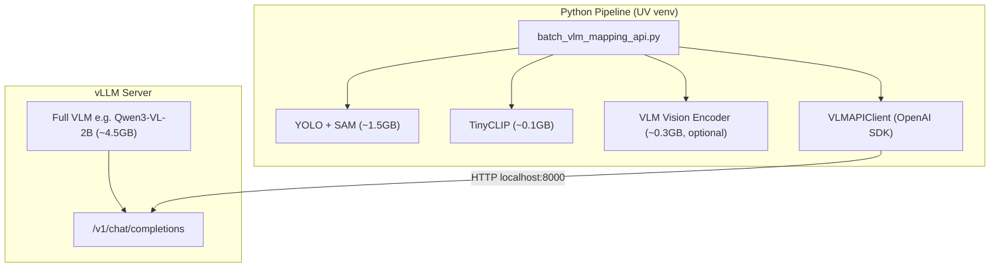

# vLLM API Integration

## Why API-Based VLMs?

Instead of deeply integrating each VLM model into the Python codebase (loading transformers models directly, handling Flash Attention, managing VRAM conflicts), we serve models via **vLLM** behind an OpenAI-compatible API. This gives us:

- **One client for all models** -- `VLMAPIClient` replaces model-specific clients (`vlm_qwen.py`, `vlm_gemma.py`, etc.)
- **vLLM handles optimization** -- Flash Attention, continuous batching, KV cache management, and tensor parallelism are all handled by the vLLM server
- **Easy model swapping** -- change one variable (`VLM_MODEL`) to switch between any supported VLM
- **VRAM isolation** -- the vLLM server manages its own GPU memory budget via `--gpu-memory-utilization`
- **Jetson deployment** -- the same API pattern works on a Jetson Orin Nano Super with a native vLLM install (no Docker required)

## Architecture



### Data Flow

1. **YOLO** detects objects in each frame, **SAM** segments them
2. **TinyCLIP** computes visual/text embeddings for each detection crop
3. *(Optional)* **VLM Vision Encoder** extracts the VLM's own visual embeddings for comparison research
4. **VLMAPIClient** sends the annotated frame + labels as a base64 JPEG to the vLLM server
5. The vLLM server runs the full VLM (encoder + LLM) and returns text captions/relations
6. Results feed into the ConceptGraphs mapping pipeline (matching, merging, edge processing)

## File Structure

```
neuro-nav/
├── conceptgraph/
│   ├── utils/vlms/
│   │   ├── vlm_api.py          # Universal API client (VLMAPIClient)
│   │   └── vlm_encoder.py      # Vision encoder extractor (VLMEncoderExtractor)
│   ├── slam/vlm_run/
│   │   └── batch_vlm_mapping_api.py  # Main batch processing script
│   └── hydra_configs/
│       ├── batch/
│       │   └── batch_vlm_mapping_api.yaml  # Hydra config
│       └── prompts/
│           ├── prompts_standard.yaml   # For capable VLMs (Qwen, InternVL, Gemma 3, etc.)
│           └── prompts_compact.yaml    # For smaller VLMs (SmolVLM, IDEFICS, Ovis, etc.)
├── shells/
│   └── run_vllm_batch.sh       # vLLM serve lifecycle + scene loop
└── VLLM_API.md                 # This file
```

## Quick Start

### 1. Run with default model (Qwen3-VL-2B)

```bash
cd ~/cmu-grad/neuro-nav
./shells/run_vllm_batch.sh
```

### 2. Run with a different model

```bash
VLM_MODEL="Qwen/Qwen2.5-VL-3B-Instruct" ./shells/run_vllm_batch.sh
```

### 3. Run with a smaller model using compact prompts

```bash
VLM_MODEL="HuggingFaceTB/SmolVLM2-2.2B-Instruct" PROMPT_CONFIG="prompts_compact" ./shells/run_vllm_batch.sh
```

### 4. Enable vision encoder embedding extraction

```bash
EXTRACT_ENCODER=true ./shells/run_vllm_batch.sh
```

### 5. Custom scenes and GPU memory

```bash
SCENES="room0 office2" GPU_MEM_UTIL=0.5 ./shells/run_vllm_batch.sh
```

## Model Support Matrix

**vLLM covers 18 of the 19 models on our target list.** The only exception is OmniVLM, which uses a custom LLaVA architecture with GGUF format designed for on-device inference. AM-RADIO is listed separately because it's a vision encoder/backbone, not a generative chat VLM.

| Model | HuggingFace ID | Prompt Config | vLLM | Encoder Extractor | Encoder Tuning | Approx VRAM |
|-------|---------------|---------------|:----:|:-----------------:|----------------|-------------|
| Qwen3-VL | `Qwen/Qwen3-VL-2B-Instruct` | `prompts_standard` | Full | **Yes** (`model.visual`) | Fine-tuned (end-to-end, DeepStack ViT) | ~4.5 GB |
| Qwen2.5-VL | `Qwen/Qwen2.5-VL-3B-Instruct` | `prompts_standard` | Full | **Yes** (`model.visual`) | Fine-tuned (end-to-end ViT) | ~6.0 GB |
| InternVL3 | `OpenGVLab/InternVL3-2B` | `prompts_standard` | Full | **Yes** (`model.vision_model`) | Fine-tuned (InternViT, jointly trained on 150B tokens) | ~4.5 GB |
| InternVL3.5 | `OpenGVLab/InternVL3_5-2B` | `prompts_standard` | Full | **Yes** (`model.vision_model`) | Fine-tuned (InternViT, jointly trained) | ~4.5 GB |
| Gemma 3 | `google/gemma-3-4b-it` | `prompts_standard` | Full | **Yes** (`model.vision_tower`) | Fine-tuned (end-to-end SigLIP) | ~8.0 GB |
| LLaVA-OneVision | `llava-hf/llava-onevision-qwen2-0.5b-ov-hf` | `prompts_standard` | Full | **Yes** (`model.vision_tower`) | Fine-tuned (SigLIP-SO400M, frozen in stage 1 then unfrozen) | ~1.5 GB |
| CogVLM | `THUDM/cogvlm-chat-hf` | `prompts_standard` | Full | **Yes** (`model.vision_model`) | Fine-tuned (EVA-CLIP ViT + visual expert layers) | ~34 GB |
| CogVLM2 | `THUDM/cogvlm2-llama3-chat-19B` | `prompts_standard` | Full* | **Yes** (`model.vision_model`) | Fine-tuned (visual expert architecture) | ~38 GB |
| MiniCPM-V 4.0 | `openbmb/MiniCPM-V-2_6` | `prompts_standard` | Full | **Yes** (`model.vpm`) | Fine-tuned (end-to-end SigLIP) | ~5.0 GB |
| MiniCPMv4.5 | `openbmb/MiniCPM-o-2_6` | `prompts_standard` | Full | **Yes** (`model.vpm`) | Fine-tuned (end-to-end) | ~5.0 GB |
| Ovis2.5 | `AIDC-AI/Ovis2.5-1B` | `prompts_compact` | Full | **Yes** (`model.visual_tokenizer`) | Fine-tuned (VisualTokenizer, custom ViT) | ~2.5 GB |
| Ovis2 | `AIDC-AI/Ovis2-1B` | `prompts_compact` | Full | **Yes** (`model.visual_tokenizer`) | Fine-tuned (VisualTokenizer) | ~2.5 GB |
| Ovis1.6 | `AIDC-AI/Ovis1.6-Gemma2-9B` | `prompts_compact` | Full | **Yes** (`model.visual_tokenizer`) | Fine-tuned (VisualTokenizer) | ~18 GB |
| SmolVLM2 2B | `HuggingFaceTB/SmolVLM2-2.2B-Instruct` | `prompts_compact` | Full | **Yes** (`model.vision_model`) | Fine-tuned (SigLIP, multimodal stages) | ~4.5 GB |
| SmolVLM-500M | `HuggingFaceTB/SmolVLM-500M-Instruct` | `prompts_compact` | Full | **Yes** (`model.vision_model`) | Fine-tuned (SigLIP) | ~1.0 GB |
| SmolVLM-256M | `HuggingFaceTB/SmolVLM-256M-Instruct` | `prompts_compact` | Full | **Yes** (`model.vision_model`) | Fine-tuned (SigLIP) | ~0.6 GB |
| IDEFICS3 | `HuggingFaceM4/Idefics3-8B-Llama3` | `prompts_compact` | Full | **Yes** (`model.vision_model`) | Fine-tuned (SigLIP) | ~16 GB |
| IDEFICS2 | `HuggingFaceM4/idefics2-8b` | `prompts_compact` | Full | **Yes** (`model.vision_model`) | Fine-tuned (SigLIP) | ~16 GB |
| OmniVLM | `NexaAIDev/OmniVLM-968M` | `prompts_compact` | **No** | **No** (custom arch, no loader) | Fine-tuned (custom LLaVA variant) | ~2.0 GB |
| AM-RADIO | -- | N/A | N/A | N/A (use directly like TinyCLIP) | N/A (standalone backbone) | ~0.3 GB |

\* CogVLM2 uses the vLLM Transformers backend with `--trust-remote-code`.

The **Encoder Extractor** column indicates whether `VLMEncoderExtractor` in `vlm_encoder.py` has a registered loader for that model family. The parenthetical shows the attribute used to access the vision encoder (e.g., `model.visual`, `model.vision_model`, `model.vision_tower`, `model.vpm`, `model.visual_tokenizer`). All 18 vLLM-supported models have encoder extraction support. To add a new model, register its family pattern in `_FAMILY_PATTERNS` and map the encoder accessor in `_LOADERS`.

### Notes

- **All modern VLMs on this list fine-tune their vision encoders end-to-end during training.** None ship with a frozen pretrained encoder. This is why comparing their encoder embeddings against standalone pretrained models (TinyCLIP, SigLIP, DINOv2) is scientifically interesting -- the VLM training process warps the encoder's embedding space to align with the LLM's language space.
- **AM-RADIO** (Robust Aligned Dual Instruction-tuned Observation) is a multi-teacher distilled vision backbone, not a generative VLM. It doesn't accept prompts or produce text. Use it like TinyCLIP -- as an embedding/feature model loaded directly in the pipeline, not behind the chat completions API.
- **OmniVLM** is a custom LLaVA variant from NexaAI designed for on-device inference (GGUF format). It may work via the vLLM Transformers backend with `--trust-remote-code`, but this is untested.
- Check [vLLM supported models](https://docs.vllm.ai/en/latest/models/supported_models.html) for the latest compatibility. Models with custom architectures may require `--trust-remote-code`.

## Prompt Configurations

### `prompts_standard` (default)
Full-featured prompts for models with strong instruction-following capability. Detailed output format instructions, multi-sentence captions, explicit spatial reasoning.

**Best for**: Qwen2.5/3-VL, InternVL3/3.5, Gemma 3, LLaVA-OneVision, MiniCPM-V, CogVLM/2

### `prompts_compact`
Simplified prompts for smaller models. Shorter templates, one-sentence captions, basic spatial relations.

**Best for**: SmolVLM (all sizes), IDEFICS2/3, Ovis (all versions), OmniVLM

Both configs share the same keys (`caption`, `captions_with_labels`, `relation`, `relations_with_labels`, `consolidate`, `consolidate_prompt`), so they're interchangeable via the `PROMPT_CONFIG` environment variable.

## Vision Encoder Embedding Extraction

When `EXTRACT_ENCODER=true`, the pipeline loads **only** the VLM's vision encoder component (~300MB for 2B models) locally in the Python pipeline. This allows comparing the VLM's fine-tuned visual representations with standalone embedding models like TinyCLIP.

### How It Works

1. `VLMEncoderExtractor` loads the full model, extracts the vision encoder (e.g., `model.visual` for Qwen), and deletes the LLM decoder
2. For each frame, detection crops are passed through both TinyCLIP AND the VLM encoder
3. VLM encoder features are saved alongside TinyCLIP features in `raw_gobs["vlm_encoder_feats"]`
4. Both are L2-normalized numpy arrays of shape `(N_detections, D)`

### Why This Matters

Every VLM on our target list fine-tunes its vision encoder end-to-end during training (see the Encoder Tuning column in the model matrix above). The VLM training process warps the encoder's embedding space away from its pretrained initialization to align with the LLM's language space. Whether that warping helps or hurts for object matching in 3D scene graphs is an open empirical question. By extracting both VLM encoder and TinyCLIP embeddings from the same crops, you can:

- Compare cosine similarity distributions between fine-tuned VLM encoder features and frozen pretrained TinyCLIP features
- Evaluate whether VLM-tuned features improve object matching/merging accuracy
- Test whether fine-tuned encoders cluster objects differently than their pretrained counterparts (e.g., does Qwen3-VL's tuned ViT separate "chair" and "office chair" better than TinyCLIP?)
- Run this comparison across multiple VLM families to see if the effect is architecture-dependent

### Supported Model Families

| Family | Encoder Attribute | Models |
|--------|------------------|--------|
| `qwen3vl` | `model.visual` | Qwen3-VL-2B/4B |
| `qwen25vl` | `model.visual` | Qwen2.5-VL-3B/7B |
| `internvl` | `model.vision_model` | InternVL3, InternVL3.5 |
| `gemma3` | `model.vision_tower` | Gemma 3 |
| `llava_ov` | `model.vision_tower` | LLaVA-OneVision |
| `minicpm` | `model.vpm` | MiniCPM-V 4.0 |
| `smolvlm` | `model.vision_model` | SmolVLM, SmolVLM2 |
| `cogvlm` | `model.vision_model` | CogVLM, CogVLM2 |

## VRAM Budget (RTX 4090 16GB)

| Component | VRAM | Notes |
|-----------|------|-------|
| vLLM server (2B model, 40%) | ~6.4 GB | `--gpu-memory-utilization 0.4` |
| YOLO-World v2 | ~0.5 GB | Loaded in pipeline |
| SAM 2.1 Base | ~0.8 GB | Loaded in pipeline |
| TinyCLIP ViT-8M | ~0.1 GB | Tiny model |
| VLM Vision Encoder (optional) | ~0.3 GB | Only when `EXTRACT_ENCODER=true` |
| PyTorch overhead | ~0.5 GB | CUDA context, etc. |
| **Total** | **~8.6 GB** | Leaves headroom for larger KV caches |

To adjust the vLLM server's GPU memory share:

```bash
GPU_MEM_UTIL=0.5 ./shells/run_vllm_batch.sh  # 50% = ~8GB for the model
```

## How to Add a New Model

1. Find the model's HuggingFace ID (e.g., `NewOrg/NewVLM-2B-Instruct`)
2. Check [vLLM supported models](https://docs.vllm.ai/en/latest/models/supported_models.html)
3. Run:

```bash
VLM_MODEL="NewOrg/NewVLM-2B-Instruct" ./shells/run_vllm_batch.sh
```

That's it. If the model needs compact prompts, add `PROMPT_CONFIG="prompts_compact"`.

For vision encoder extraction support, add the model family to `_FAMILY_PATTERNS` in `vlm_encoder.py` and map it to the correct encoder attribute in `_LOADERS`.

## Troubleshooting

### vLLM serve fails to start

When the health check times out, the script prints the last 50 lines of vLLM output. Common causes:
- **VRAM OOM**: Reduce `GPU_MEM_UTIL` (e.g., `0.3`)
- **Model not found**: Check the HuggingFace ID is correct
- **Auth required**: Set `HUGGING_FACE_HUB_TOKEN` for gated models

### Server health check times out

The model download can take a while on first run. Increase the timeout:

```bash
HEALTH_TIMEOUT=600 ./shells/run_vllm_batch.sh
```

### Response parsing failures

If you see fallback captions like "A chair.", the model may not be following the JSON format. Try:
- Switching to `prompts_compact` for smaller models
- Increasing `MAX_MODEL_LEN` (some models need more context)
- Checking the raw responses in the logs (set `logging_level=DEBUG` in Hydra overrides)

### CUDA out of memory in the Python pipeline

The pipeline (YOLO + SAM + TinyCLIP + encoder) runs alongside the vLLM server. If OOM:
- Reduce `GPU_MEM_UTIL` to give more room to the pipeline
- Disable encoder extraction (`EXTRACT_ENCODER=false`)
- Use a smaller YOLO model or reduce SAM resolution

### Port already in use

```bash
VLLM_PORT=8001 ./shells/run_vllm_batch.sh
```

The script will automatically set `VLM_API_URL=http://localhost:8001/v1`.
