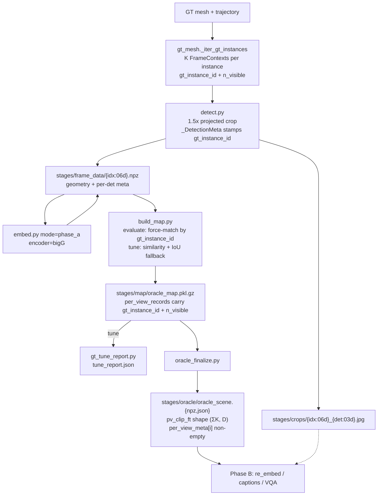

# Ground-Truth Phase A (`gt_instances` mode)

> **Last updated:** 2026-04-19
>
> Explains how the ground-truth mesh pipeline produces the oracle map used as
> Phase B input — where views come from, how instances are matched, how this
> differs from trajectory mode's CLIP-driven matching, and how per-view data
> flows from the mesh all the way into `oracle_scene.npz`.

---

## Overview

GT Phase A is triggered by
`pipeline_mode=gt_mesh segmentation_backend=gt_instances` plus a
`gt_matching_mode` choice:

| Driver | `gt_matching_mode` | Output root | Use case |
|---|---|---|---|
| [`run_gt_evaluate.sh`](../generate_groundtruth/run_gt_evaluate.sh) | `evaluate` | `ReplicaGroundTruth` | Canonical 1:1 oracle. Every GT instance lands as its own map object. |
| [`run_gt_tune.sh`](../generate_groundtruth/run_gt_tune.sh) | `tune` | `ReplicaGroundTruthTune` | Run the real similarity matcher against labeled GT to calibrate `sim_threshold`, `iou_merge_kappa`, and `spatial_sim_type`. Emits `tune_report.json`. |

`run_gt_phase_a.sh` still exists but is a thin deprecated wrapper that
forwards to `run_gt_evaluate.sh`.

Both modes share the same detect → embed → build_map → oracle_finalize
sequence:

1. Load the canonical semantic mesh and split vertices by `objectId` →
   one point cloud per GT instance.
2. Load the canonical camera trajectory (same NICE-SLAM frames used by
   trajectory mode).
3. For each GT instance, pick the **K trajectory frames that see it best**
   and yield one `FrameContext` per view. Each view carries the semantic
   `gt_instance_id` and the projected-vertex visibility count `n_visible`.
4. `detect.py` writes the 1.5x projected crop to `crops/*.jpg` and stamps
   `gt_instance_id` + `n_visible` onto `_DetectionMeta` in `frame_data/*.npz`.
5. `embed.py` (Phase A) fills `clip_ft` on every frame-data record.
6. `build_map.py` matches detections into map objects.  In **evaluate**
   mode it force-routes every detection to the existing map object with
   the matching `gt_instance_id`, bypassing similarity entirely.  In
   **tune** mode it runs the real `match_detections_to_objects`
   similarity + bbox-IoU fallback and leaves `gt_instance_id` on every
   detection for the downstream report.
7. `oracle_finalize.py` serializes per-object + per-view data into
   `oracle_scene.{npz,json}` and `map/oracle_map.pkl.gz`.  Per-view
   records now carry `gt_instance_id` and `n_visible`, so downstream
   ablations (min-frames post-hoc, instance-level recall) don't need to
   round-trip through `frame_data`.

---

## Evaluate mode vs tune mode

### `gt_matching_mode=evaluate` — 1:1 oracle

Used by `run_gt_evaluate.sh`.  `match_detections_to_objects` short-circuits:

```semgraph/slam/mapping.py
if gt_matching_mode == "evaluate" and detection_list is not None and objects is not None:
    gt_to_obj: dict[int, int] = {}
    for obj_idx, obj in enumerate(objects):
        oid = obj.get("gt_instance_id")
        if oid is not None:
            gt_to_obj[int(oid)] = obj_idx

    for detected_obj_idx in range(len(detection_list)):
        det_gt = detection_list[detected_obj_idx].get("gt_instance_id")
        if det_gt is not None and int(det_gt) in gt_to_obj:
            match_indices.append(gt_to_obj[int(det_gt)])
        else:
            match_indices.append(None)
    return match_indices
```

- K views of GT instance 17 all land on the same map object by construction.
- Distinct GT instances with overlapping bounding boxes (the plant in a
  pot, a book on a shelf, mirrors on the wall) stay distinct — no CLIP
  cosine or bbox-IoU can collapse them.
- `build_map.main_standalone` additionally forces
  `obj_min_detections=1`, `obj_min_points=0`, `merge_overlap_thresh=-1`
  so the final-frame filter/merge can't drop or consolidate instances
  post-match.

This is the mode you want whenever the oracle is the target (Phase B
re-embed sweeps, synthesize_bigg_variant, `compare_oracles.py`).

### `gt_matching_mode=tune` — diagnostic

Used by `run_gt_tune.sh`.  The matcher runs its full similarity +
bbox-IoU fallback just like trajectory mode, but with `gt_instance_id`
on every detection.  `gt_tune_report.py` reads the resulting
`oracle_map.pkl.gz` and produces `tune_report.json` with:

- **Per-instance recall** — fraction of unique `gt_instance_id`s that
  appear as the "winner" of at least one final map object.
- **Merge confusion** — for each final object, a `{gt_instance_id:
  n_views}` breakdown. Cross-instance objects are the ones where the
  matcher collapsed distinct GT instances.
- **Absorbed-instance pairs** — `(winner_id, absorbed_id,
  n_absorbed_views)`, sorted by severity. These are the concrete
  failures to chase down.
- **Pair histograms** — bbox-IoU and CLIP cosine distributions over
  detection pairs, split by same-id vs different-id. Use these to pick
  `sim_threshold` and `iou_merge_kappa` values that separate the two
  populations cleanly.

Tune mode writes to a separate `OUTPUT_ROOT` (`ReplicaGroundTruthTune`
by default) so the canonical evaluate-mode oracle is never at risk of
being overwritten by a diagnostic run.

---

## Where do views come from?

**Not synthesized, not random — real trajectory frames ranked by visibility.**

The GT backend loads the same NICE-SLAM camera trajectory the trajectory
backend uses:

```311:315:semgraph/slam/geometry/gt_mesh.py
    @staticmethod
    def _load_camera_trajectory(cfg: Any) -> list[dict]:
        """Load camera frames, discarding the dataset object."""
        frames, _dataset = GeometryBackend.load_camera_frames(cfg)
        return frames
```

For Phase A the stride is `1`, so every frame in the trajectory is a
candidate (~2000 for room0).

For every instance, `select_best_views` ranks every frame by how many of
the instance's mesh vertices project (a) in front of the camera and (b)
inside the image rectangle, then returns the top K frames whose
visibility count is ≥ `min_visible_points` (default 50).  The function
now returns `(frame, n_visible)` pairs so the visibility score rides
downstream:

```semgraph/slam/geometry/projection.py
def select_best_views(
    instance_pcd_points: np.ndarray,
    frames: list[dict],
    top_k: int = 5,
    min_visible: int = 50,
) -> list[tuple[dict, int]]:
    ...
    return [
        (frames[fi], count)
        for count, fi in scores[:top_k]
        if count >= min_visible
    ]
```

Deterministic — same K always returns the same K frames, and the
visibility count travels with each frame.  Nearby instances will share
views; far-apart instances won't.

Knobs (read from env via [`semgraph/hydra_configs/base_mapping.yaml`](../semgraph/hydra_configs/base_mapping.yaml)):

| Variable | Default | Effect |
|---|---|---|
| `GT_MESH_BEST_VIEWS_K` | 10 | Views yielded per instance (top-K by visibility). |
| `GT_MESH_MIN_VISIBLE_POINTS` | 50 | Min vertices that must project into a frame for it to qualify. Also the instance-accept threshold. |
| `GT_MATCHING_MODE` | `evaluate` | `evaluate` (force-match by gt_instance_id) or `tune` (similarity matcher). |

K=10 is the new default.  It's enough views for per-object CLIP averaging
to stabilize across encoder noise, and with `n_visible` stored per-view
the tune report and downstream ablations can post-hoc down-select
without re-running Phase A.

---

## Counting FrameContexts / crops

For a scene with `N` GT instances, the total FrameContext count is at
most `N * K`. It's less when some instances don't have K visible frames
(tiny meshes whose `min_visible_points` filter knocks out all but a
handful of viewpoints):

```semgraph/slam/geometry/gt_mesh.py
    def _precount_gt_instances(self, ctx: GTMeshContext) -> int:
        top_k = ctx.best_views_k
        min_vis = ctx.min_visible_points
        count = 0
        for pcd in ctx.instance_pcds.values():
            pts = np.asarray(pcd.points)
            if len(pts) < min_vis:
                continue
            views = select_best_views(
                pts, ctx.frames, top_k=top_k, min_visible=min_vis
            )
            if not views:
                continue
            count += len(views)
        return count
```

Example: room0 has 87 GT instances. With `K=10` the ceiling is
`87 * 10 = 870` crops / frame_data npzs / per-view records.  Scenes
with a handful of tiny instances land a few percent below the ceiling.

---

## Per-view construction

For each selected view, `_iter_gt_instances` does the following:

```semgraph/slam/geometry/gt_mesh.py
for view_idx, (view, n_visible) in enumerate(best_views):
    image_rgb = self._load_image(view["color_path"])
    H, W = image_rgb.shape[:2]
    pixel_coords, valid = project_points_to_frame(
        pts, view["pose"], view["intrinsics"], H, W,
    )
    ...
    raw_gobs = {
        ...,
        "gt_instance_id": int(iid),
        "n_visible": int(n_visible),
    }
    yield FrameContext(
        frame_idx=obj_idx * top_k + view_idx,
        ...,
        instance_id=int(iid),
        extra={
            "raw_gobs": raw_gobs,
            "instance_pcd": pcd,
            "n_visible": int(n_visible),
        },
    )
```

Per view it produces:

- `frame_idx = obj_idx * K + view_idx` (globally unique across the iterator).
- An RGB image loaded from that view's `color_path`.
- `pixel_coords` + `valid` mask from projecting the instance PCD through
  the view's pose and intrinsics.
- `xyxy` = tight 2D bbox around the valid projected pixels.
- A boolean `mask` tagging those pixels.
- A single-detection `raw_gobs` dict with `gt_instance_id` and
  `n_visible` stamped in.
- A `FrameContext` with `skip_segmentation=True` and
  `skip_matching=False` so the matching path in `build_map` owns the
  merge decision (force-match in evaluate mode, similarity in tune mode).

`_lift_gt_instance` propagates `gt_instance_id` and `n_visible` onto the
detection dict so they survive detect.py serialization into
`frame_data/*.npz`:

```semgraph/slam/geometry/gt_mesh.py
def _lift_gt_instance(self, frame_ctx, cfg):
    pcd = frame_ctx.extra["instance_pcd"]
    bbox = get_bounding_box(cfg.get("spatial_sim_type", "iou"), pcd)
    det = {"pcd": pcd, "bbox": bbox}
    if frame_ctx.instance_id is not None:
        det["gt_instance_id"] = int(frame_ctx.instance_id)
    n_visible = frame_ctx.extra.get("n_visible")
    if n_visible is not None:
        det["n_visible"] = int(n_visible)
    return [det]
```

---

## Per-view data flow



Each per-view record now carries both fields:

```python
{
    "frame_idx": int,          # globally unique: obj_idx * K + view_idx
    "clip_ft": np.ndarray,     # encoder-native feature (bigG in Phase A)
    "n_points": int,
    "crop_path": str,
    "crop_bbox": None,
    "n_visible": int | None,   # projected-vertex visibility, for post-hoc view ablations
    "gt_instance_id": int | None,  # semantic GT id, for tune-report analysis
}
```

`oracle_finalize` concatenates these into `pv_clip_ft` with offsets plus
a parallel list of `_PerViewMeta` rows in `oracle_scene.json`.  With
`gt_instance_id` on each view you can derive instance-level recall and
merge confusion directly from `oracle_scene.json` — no need to open the
pickled map.

---

## Why this used to silently fail

Before the multi-view + matching-mode rebuild:

- `_iter_gt_instances` yielded **one** FrameContext per instance with
  `skip_matching=True`.
- `skip_matching=True` routed through a shortcut in `build_map.py` that
  bypassed `merge_obj2_into_obj1` entirely.
- `merge_obj2_into_obj1` was the **only** site that appended to
  `obj["per_view_records"]`.
- Result: every GT-mode object had `per_view_records == []`,
  `oracle_scene.npz:pv_clip_ft` had shape `(0, 0)`, `per_view_meta[i]`
  was empty, and Phase B `re_embed` / `synthesize_bigg_variant.py`
  produced stub variants that looked OK in summary tables.

The fix is in three parts:

1. **Multi-view iterator** — `_iter_gt_instances` yields K FrameContexts
   per instance with `skip_matching=False`.
2. **Seed at every site** — `seed_per_view_record` is called wherever a
   detection first becomes a map object (first-detection append,
   `skip_matching` extend, batch-mode cluster seed, and inside
   `merge_obj2_into_obj1` itself pre-mutation).
3. **Instance-aware matcher** — the evaluate-mode force-match path
   preserves the 1:1 GT instance → map object invariant without
   depending on CLIP or bbox-IoU thresholds that would otherwise collapse
   spatially-overlapping instances.

[`generate_groundtruth/verify_gt_phase_a.py`](../generate_groundtruth/verify_gt_phase_a.py)
carries hard-failure assertions for these invariants so the quiet-pass
behavior can't recur.

---

## Operating notes

- **Disk:** `N * K` JPEGs per scene at quality 95 → ~15 KB each.
  With `K=10` and the four default Replica scenes (≈330 GT instances
  total) you're at ~50 MB of crops, plus the frame_data npzs (~80–120 MB
  per scene with bigG features).
- **Time:** dominated by the bigG encoder pass. Geometry iteration is
  IO-bound; build_map is CPU. Evaluate mode is materially faster than
  tune mode because it skips the O(M·N) similarity tensors every frame.
- **Resumability:** both drivers have per-stage skip guards
  (`frame_data/*.npz` present, `.embed_done` stamp,
  `map/oracle_map.pkl.gz` present, `oracle_scene.npz` present). To
  force a full rebuild for one scene, delete those artifacts under its
  stage root — `FORCE=1` alone only bypasses the whole-scene top-level
  guard, not the per-stage ones.
- **Tuning K:** K=10 is the new default and the practical minimum for
  Phase B encoder sweeps. K=5 still works but leaves the weighted-avg
  and entropy-min fusion strategies undifferentiated.

---

## See also

- [MAPPING_WORKFLOW.md](MAPPING_WORKFLOW.md) — trajectory-mode pipeline.
- [PHASE_B_RUNBOOK.md](PHASE_B_RUNBOOK.md) — Phase B sweep operations.
- [STAGE_EMBED.md](STAGE_EMBED.md) — Phase A / re_embed encoder internals.
- [BATCH_MATCHING.md](BATCH_MATCHING.md) — the matching/merge logic both
  modes share.
